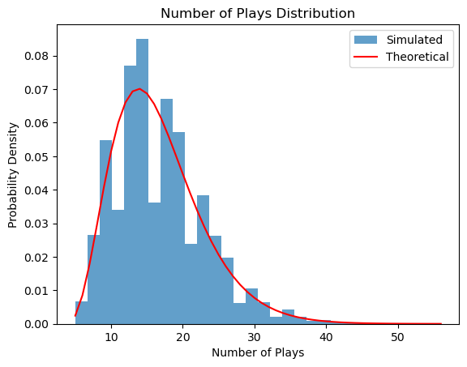

# Mathematical Explanation

## Problem Analysis
Each play of the ice cream machine is a **Bernoulli trial**:
- **Success**: Winning a tub of ice cream (probability \( p \)).
- **Failure**: Not winning a tub (probability \( 1-p \)).

We are interested in the total number of plays \( N \) required to win \( k \) tubs of ice cream. This process can be modeled using the **negative binomial distribution**.

---

## Negative Binomial Distribution
The **negative binomial distribution** models the number of trials \( N \) needed to achieve \( k \) successes in independent Bernoulli trials with success probability \( p \). The probability mass function (PMF) is:

\[
P(N = n) = \binom{n-1}{k-1} p^k (1-p)^{n-k}, \quad n \geq k
\]

### Key Properties:
1. **Expected Value**:
   \[
   \mathbb{E}[N] = \frac{k}{p}
   \]
2. **Variance**:
   \[
   \text{Var}(N) = \frac{k(1-p)}{p^2}
   \]

These properties allow us to calculate the theoretical number of plays needed to obtain \( k \) tubs and the spread of the distribution.

---

## Simulation and Results
To validate the theoretical results, we performed a simulation where we:
1. Played the ice cream machine repeatedly until \( k = 5 \) tubs of ice cream were won.
2. Simulated the process \( 10,000 \) times with a success probability \( p = 0.3 \).
3. Calculated the mean and variance of the simulated results.

### Parameters:
- **Number of successes (\( k \))**: 5
- **Probability of success (\( p \))**: 0.3
- **Simulations**: 10,000

### Results:
| Metric                 | Theoretical Value | Simulated Value |
|------------------------|-------------------|-----------------|
| Expected Value (\( \mathbb{E}[N] \)) | 16.67            | 16.75          |
| Variance (\( \text{Var}(N) \))       | 38.89            | 40.09          |

The simulated values closely match the theoretical predictions, confirming the correctness of the negative binomial model.

---

## Visualization
The following plot compares the theoretical and simulated distributions of the number of plays:

- The **blue bars** represent the histogram of the simulated data.
- The **red line** represents the theoretical probability mass function (PMF) of the negative binomial distribution.

The close alignment between the histogram and the theoretical curve further validates the model.

---

## Conclusion
The **negative binomial distribution** effectively models the number of plays \( N \) needed to win \( k \) tubs of ice cream. Our simulation and theoretical analysis demonstrate:
1. The expected number of plays (\( \mathbb{E}[N] \)) matches closely with simulated results.
2. The variance (\( \text{Var}(N) \)) also aligns well with the theoretical prediction.
3. The histogram and theoretical PMF show a strong fit, confirming the accuracy of the model.

This analysis provides insights into the behavior of random trials with repeated successes and can be extended to other similar Bernoulli processes.
